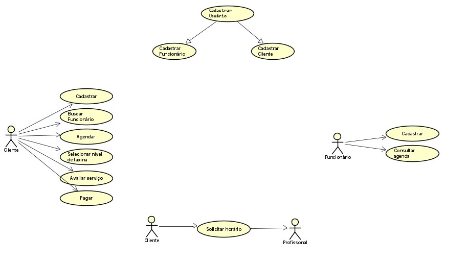

# Especificações do Projeto

## Personas

Definição do diagrama de personas:

           
|Patrícia dos Anjos                                | Aplicativos     |
|--------------------------------------------------|-----------------|
|Idade: 38                                         |Linkedin         |
|Ocupação: Gerente de vendas hospitalares.         |Instagram        |

|Amanda Baião                                      | Aplicativos     |
|--------------------------------------------------|-----------------|
|Idade: 20                                         |Facebook         |
|Ocupação: Estudante de Antropologia               |GetNinjas        |
|**Motivações:** Amanda pretende conseguir juntar dinheiro para os processos seletivos de mestrado na Europa  |**Frustrações:** Devido ao alto custo de vida no Brasil, Amanda precisa se desdobrar para conseguir renda extra e conseguir pagar os custos para estudar fora do país, alcançando melhores oportunidades de trabalho.|**Hobbies, História:** Amanda está no 2º período de Antropologia e pleiteia uma bolsa de estudos no British Museum e mestrado na Universidade de Westminster, para isso ela busca trabalhos paralelos ao estágio para conseguir juntar dinheiro para pagar as provas de proficiência e auxílio de estadia no exterior.| 

 
|Luiza Aragão                                      | Aplicativos     |
|--------------------------------------------------|-----------------|
|Idade: 30                                         |Facebook         |
|Ocupação: Gerente Financeira de Banco Digital     |Bancos Digitais  |

 
|Adolfo Luís                                       | Aplicativos     |
|--------------------------------------------------|-----------------|
|Idade: 31                                         |Facebook         |
|Ocupação: Cozinheiro                              |Instagram        |

## Histórias de Usuários

Com base na análise das personas forma identificadas as seguintes histórias de usuários:

|EU COMO... `PERSONA`| QUERO/PRECISO ... `FUNCIONALIDADE` |PARA ... `MOTIVO/VALOR`                 |
|--------------------|------------------------------------|----------------------------------------|
|Adolfo Luís   | Ganhar renda extra atuando particularmente em domicílios.            | Ter condições financeiras para criação do filho.               |
|Patrícia dos Anjos        | Limpeza da casa em períodos de 4(quatro) em 4(quatro) dias.                  | Devido à alta demanda de tempo para o trabalho ela não consegue fazer manutenção da casa onde reside.  |
|Amanda Baião |Local para ganhar uma renda extra e para criação de uma poupança. |Ela busca trabalhos paralelos ao estágio para conseguir juntar dinheiro para pagar as provas de proficiência e auxílio de estadia no exterior|
|Luiza Aragão |Auxílio nas atividades de cozinha, limpeza, e pequenos cuidados do lar. |Precisa de auxílio regular em seu lar, como está atuando em home office não encontra tempo para pequenas tarefas |

## Requisitos

As tabelas que se seguem apresentam os requisitos funcionais e não funcionais que detalham o escopo do projeto.

### Requisitos Funcionais

|ID    | Descrição do Requisito  | Prioridade |
|------|-----------------------------------------|----|
|RF-001| O sistema deve exibir na tela principal as opções de cadastro, login e alteração de senha  | ALTA | 
|RF-002| O sistema deve conter uma opção que permita o usuário criar uma nova senha em caso de esquecimento  | ALTA |
|RF-003| O usuário deve informar nas telas de cadastro e login se será prestadora ou contratante   | MÉDIA |
|RF-004| O usuário contratante informe a região que está situada e quais serviços irá precisar    | ALTA |
RF-005| O sistema deverá permitir que o usuário filtre as buscas por localização | MÉDIA|
|RF-006| O usuário prestador de serviço deve informar o valor diário do seu trabalho e quais serviços fornece    | MÉDIA |
|RF-006| O sistema deve solicitar um feedback dos usuários, tanto do contratante como do prestador, ao final do serviço prestado   | MÉDIA |
|RF-007| O sistema deve fornecer informações de contato para que os usuários possam receber suporte e/ou tirar dúvidas   | MÉDIA |
|RF-008| A aplicação deverá permitir ao usuário visualizar informações sobre a função principal do sistema na tela inicial. | BAIXA |

### Requisitos não Funcionais

|ID     | Descrição do Requisito  |Prioridade |
|-------|-------------------------|----|
|RNF-001| O sistema deve armazenados e gerenciados em um banco de dados padrão SQL | ALTA |
|RNF-002| O sistema deve ser responsivo, permitindo a visualização adequada em um aparelho menor  | MÉDIA | 
|RNF-003| O sistema deve ser compatível com os principais navegadores do mercado  |  MÉDIA | 
|RNF-004| O sistema deve realizar consultas e pesquisas dos usuários em no máximo 10s | BAIXA |

## Restrições

A tabela a seguir apresenta as questões que limitam a execução desse projeto e que se configuram como obrigações claras para o seu desenvolvimento: 

|ID| Restrição                                             |
|--|-------------------------------------------------------|
|01| O projeto deverá ser entregue no final do semestre letivo, não podendo extrapolar a data de 13/06/2022.  |
|02| A equipe não pode subcontratar o desenvolvimento do trabalho.         |
|03| A página inicial deve permitir o cadastro, login e alteração de senha. |
|04| O termo de responsabilidade aceito no cadastro isenta de quaisquer ocorrências resultantes de atendimentos e comunicação entre os usuários |
|05| A localização geográfica deverá ser restrita a usuários dentro do Brasil. |
|06| O sistema deverá ser implementado em linguagem C#, .NET, Javascript, HTML5 e CSS3. |
|07| Os usuários não poderão ter acesso aos dados pessoais de outros usuários. |
|08| A aplicação deve permitir realizar cadastro de serviços. |

## Diagrama de Casos de Uso

