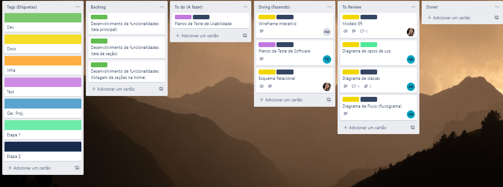

# Metodologia

A metodologia escolhida por nós neste trabalho, será utilizada para o melhor desenvolvimento e manutenção dos códigos com o intuito de organizar a equipe na realização das tarefas.

## Controle de Versão

|Ambiente|Plataforma|Link de Acesso|
|--------|----------|--------------|
|Repositório de código fonte|Github|[Github](https://github.com/ICEI-PUC-Minas-PMV-ADS/pmv-ads-2022-1-e2-proj-int-t4-sistema-de-contratacao-de-domesticas)|
|Documentos do projeto|Google Drive|[Google Drive](https://drive.google.com/drive/u/1/folders/1UxTwJMEI0befRfgNOEOdxKRZW9BWRldS)|
|Projeto de interface e Wireframes|Figma|[Figma](https://www.figma.com/file/RDZ56R1yrkylvVthPuLZq4/Untitled?node-id=0%3A1)|
|Gerenciamento de Projetos|Trello|[Trello](https://trello.com/b/1FLxIkyC/trabalho-ads-2-semestre)|

A ferramenta de controle de versão adotada no projeto foi o
[Git](https://git-scm.com/), sendo que o [Github](https://github.com)
foi utilizado para hospedagem do repositório.

O projeto segue a seguinte convenção para o nome de branches:

- `main`: versão estável já testada do software
- `unstable`: versão já testada do software, porém instável
- `testing`: versão em testes do software
- `dev`: versão de desenvolvimento do software

Quanto à gerência de issues, o projeto adota a seguinte convenção para
etiquetas:

- `documentation`: melhorias ou acréscimos à documentação
- `bug`: uma funcionalidade encontra-se com problemas
- `enhancement`: uma funcionalidade precisa ser melhorada
- `feature`: uma nova funcionalidade precisa ser introduzida

## Gerenciamento de Projeto

### Divisão de Papéis

A equipe utiliza metodologias ágeis, tendo escolhido o Scrum como base para definição do processo de desenvolvimento.

A equipe está organizada da seguinte maneira:

-  Scrum Master: xxx
-  Product Owner: xxx
-  Equipe de Desenvolvimento
        ◦ xxx
        ◦ xxx
        ◦ xxx
 
### Processo
 
Para organização e distribuição das tarefas do projeto, a equipe está utilizando o Trello estruturado com as seguintes listas:

- Tags: lista de tarefas demonstrativa com as etiquetas utilizadas na organização do projeto
- Backlog: recebe as tarefas a serem trabalhadas e representa o Product Backlog. Todas as atividades identificadas no decorrer do projeto também devem ser incorporadas a esta lista.
- To do: Esta lista representa o Sprint Backlog. Este é o Sprint atual que estamos trabalhando.
- Doing: Quando uma tarefa tiver sido iniciada, ela é movida para cá.
- To Review: Quando as tarefas são concluídas, eles são movidos para a revisão. O objetivo é que as tarefas sejam revisadas por outro membro da equipe, sempre tendo um double check nas tarefas realizadas.
- Done: nesta lista são colocadas as tarefas que passaram pelos testes e revisões e estão prontos para ser entregues ao usuário ou levados para branch main. Não há mais edições ou revisões necessárias, a tarefa está concluída.

O quadro kanban do grupo no Trello está disponível através da URL [Trello](https://trello.com/b/1FLxIkyC/trabalho-ads-2-semestre) e é apresentado, no estado atual, na figura baixo. A definição desta estrutura se baseou na proposta feita por Littlefield (2016).

As tarefas são, ainda, etiquetadas em função da natureza da atividade e seguem o seguinte esquema de cores/categorias:

- Dev (verde)
- Docs (amarelo)
- Infra (laranja)
- Test (roxo)
- Ger. Proj. (azul)

### Ferramentas

As ferramentas empregadas no projeto são:

- Visual Studio.
- Microsoft Teams
- Figma (wireframe)
- Lucidchart (modelo E-R)

O editor de código foi escolhido porque ele possui uma integração com o
sistema de versão, além de possuir extensão .NET que é essencial para o desenvolvimento da aplicação em C#. As ferramentas de comunicação utilizadas possuem
integração semelhante e são recomendadas pelos usuários, por isso foram selecionadas. Por fim, para criar
diagramas utilizamos essas ferramentas por melhor captarem as
necessidades da nossa solução.

