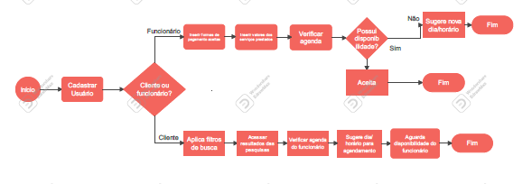

# Projeto de Interface

Pré-requisitos: <a href="2-Especificação do Projeto.md"> Documentação de Especificação</a>

Visão geral da interação do usuário pelas telas do sistema e protótipo interativo das telas com as funcionalidades que fazem parte do sistema (wireframes).

 Apresente as principais interfaces da plataforma. Discuta como ela foi elaborada de forma a atender os requisitos funcionais, não funcionais e histórias de usuário abordados nas <a href="2-Especificação do Projeto.md"> Documentação de Especificação</a>.

## Diagrama de Fluxo

|FLUXO DO USUÁRIO | DESCRIÇÃO | RF |
|-----------------|-----------|----|
|Tela inicial| O sistema deve exibir na tela principal as opções de cadastro e login e alteração de senha  |RF-001|
|Tela localização| O sistema deverá permitir que o usuário filtre as buscas por localização |RF-005|
|Tela perfil prestador| O usuário contratante deverá agendar os serviço desejado de acordo com a disponibilidade do usuário prestador|RF-008|
|Tela forma de pagamento| O usuário deverá informar a sua forma de pagamento (dinheiro, pix ou débito) |RF-009|

 //adicione a imagem na pasta img

## Wireframes 

Link do Figma para visualizar (https://www.figma.com/file/dUcHQDq0alOdRbPMwQLaZx/Limpou---Wireframes?node-id=15%3A2)

### Telas iniciais de cadastro e login

#### Telas de apresentação 

Telas iniciais com rolagem e opção de tirar dúvidas 

#### Telas de login e cadastro de usuários

#### Tela "esqueci minha senha" e redefinição de senha

#### Tela de personalização do usuário 1

Localização (Ambos) e tipo de serviço (Prestador)

#### Tela de personalização do usuário 2

Tipo de serviço solicitado (Contratante) 

#### Tela de personalização do usuário 3

Formas de pagamento 

#### Tela de perfil de ambos usuários 

#### Tela "Agenda"

Solicitar e ler os pedidos feitos 

#### Tela "Feedback"

Ambos os usuários conseguem visualizar seus feedbacks 

#### Tela de pesquisa e opção "Filtrar"

