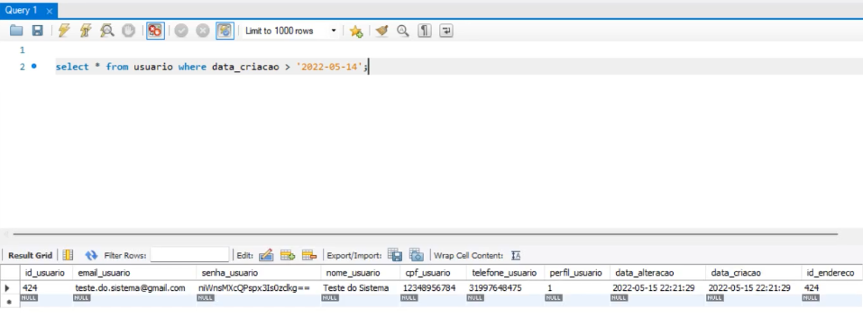

# Registro de Testes de Software 

## CT-01 – Cadastro do usuário 

Ao verificamos no MySQL podemos ver que os dados de cadastro são armazenados perfeitamente, na tela podemos inserir os dados: 

* Nome: Teste do Sistema 
* E-mail: teste.do.sistema@gmail.com 
* Senha: protegida 
* Endereço: 424 
* Telefone de contato: 31997648475 
* Sexo: feminino 

### Observações importantes em Cadastro do usuário:

Neste ponto, a equipe verificou que algumas melhorias podem ser aplicadas: 

* Precisamos armazenar também o sexo do cliente, que não apareceu no banco de dados como esperado; 
* Adequar fontes de textos mais harmônicas e padronizar seus tamanhos. 

## CT-02 - Tela inicial para login 

### Observações importantes em Tela Inicial: 

## CT-03 – Esqueceu Senha 

### Observações importantes em Esqueceu Senha:

## CT-04 – Solicitação de Serviço 

### Observações importantes em Solicitação de Serviço: 

## CT-05 – Buscar Localização 

### Observações importantes em Buscar Localização:

## CT-06 – Feedbacks dos usuários 

### Observações importantes em Feedbacks dos usuários: 

## CT-07 – Suporte ao usuário. 

### Observações importantes em Suporte ao usuário: 

## CT-08 – Sobre Nós 

### Observações importantes em Sobre Nós:

## CT-09 – Sobre Nós 

### Observações importantes em Sobre Nós: 
